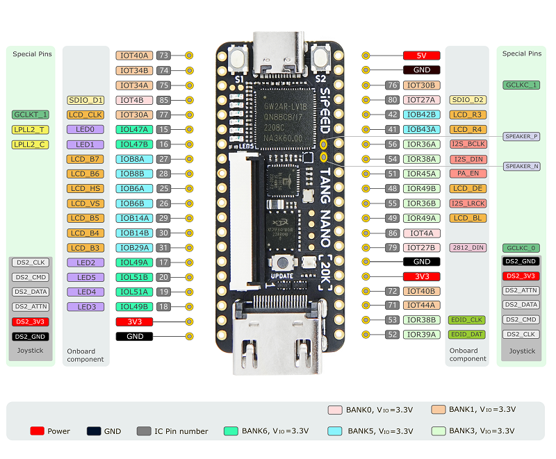

# MSXgoauldSD_usbkb — MSX Goa'uld with USB keyboard & joystick

Fork of **[jabadiagm/MSXgoauldSD_tn20k](https://github.com/jabadiagm/MSXgoauldSD_tn20k)** — the FPGA "Z80-socket replacement" that turns a real MSX into an MSX2+ on a Tang Nano 20K — adding a **USB keyboard and a USB joystick/gamepad** that work **alongside** the MSX's own keyboard and joysticks, through a **Raspberry Pi Pico / RP2040** over a single UART wire. Everything the MSX already does (real keyboard, joysticks, cartridges, SD, WiFi) keeps working; the USB devices are *merged in*, not a replacement.

**Derived from the great work of:**
- **jabadiagm** — MSX Goa'uld: the FPGA MSX2+ core and board. <https://github.com/jabadiagm/MSXgoauldSD_tn20k>
- **Chandler-Klüser** — MSX Goa'uld *Guardian Angel*: the RP2040 USB-host firmware (based on the No0ne / pdaxrom HID parser). <https://github.com/Chandler-Kluser/msx-goauld-ga>
- **Ryan Wendland (Ryzee119)** — `tusb_xinput`, the TinyUSB XInput host driver (MIT). <https://github.com/Ryzee119/tusb_xinput>

**License:** GPLv3 (inherited). The vendored `tusb_xinput` driver keeps its MIT header.

## Features
- **USB keyboard** alongside the physical MSX keyboard — **US / International** layout, non-blocking make/break, modifiers (Shift/Ctrl/Graph/Code).
- **USB joystick / gamepad** merged with the real MSX joysticks — **generic HID *and* XInput (Xbox)** pads.
- **One data wire**: RP2040 → FPGA over UART (Tang Nano pin 75). The joystick needs no extra pins (same link).
- **WS2812 status LED** on the RP2040 (red / green / yellow / white).
- **WiFi (ESP-01S)** ready in the FPGA core (optional).
- Real keyboard, joysticks, slots and cartridges are untouched.

## How it works
The Goa'uld board replaces the MSX's Z80, so the FPGA sits on the real system bus. It does **not** re-implement the keyboard/joystick ports — the real motherboard scans them and the FPGA just *watches* the bus. The RP2040 runs a TinyUSB **host**, reads the USB keyboard + gamepad, and sends keyboard **make/break** events (plus a periodic full-matrix resync) and a **joystick byte** (`0xB0 <port> <state>`) over UART. Inside the FPGA these are **AND-merged** (active-low) into the MSX keyboard-matrix read and the PSG joystick read, so the **USB and the real devices coexist** — use either, both reach the MSX.

## Binaries (see [Releases](../../releases) or [`production/`](production/))
| File | What it is |
|---|---|
| `MSXgoauldSD_usbkb.fs` | FPGA bitstream (Tang Nano 20K, GW2AR-18) with the keyboard + joystick merge. |
| `rp2040_keyboard.uf2` | RP2040 firmware (Waveshare RP2040-Zero, WS2812 LED on GPIO16). |

> The `.uf2` targets the **RP2040-Zero**. For a plain Raspberry Pi Pico, rebuild with `-DRP2040_ZERO=0` (mono LED on GPIO25).

## Status LEDs (WS2812)

### On-board LED (RP2040-Zero)
A single WS2812 showing one **priority** colour:
| Colour | Meaning |
|---|---|
| 🔵 Blue blink (3×) at power-up | Firmware booted OK |
| 🔴 Solid red | Alive — nothing connected |
| 🟢 Solid green | USB **keyboard** connected |
| 🟡 Solid yellow | USB **gamepad** connected |
| ⚪ White flash | Key press / joystick activity |

### Optional external 8-LED panel (on the case)
An 8× WS2812 stick mounted on the case turns the status into a **panel where each LED is a different signal** (instead of one colour). Driven from **RP2040 GP14**; the on-board LED keeps working alongside it.


**Board:** a generic **WS2812-8 RGB** stick (8 × WS2812 / NeoPixel on a PCB) — e.g. [AliExpress (product 1005009810895755)](https://www.aliexpress.com/item/1005009810895755.html).

**Pinout** — two pad rows; **use the `DIN` side** (the `DOUT` side just chains a second strip):

| Side | Pads |
|---|---|
| **Input (use this)** | `GND` · **`DIN`** · `5V` · `GND` |
| Output (chain) | `GND` · `DOUT` · `5V` · `GND` |

**Wiring** — the strip is rated **4–7 VDC**:
```
RP2040 GP14  ->  strip DIN    (3.3 V data, direct -- no level shifter)
common GND   ->  strip GND
MSX +5V --|>|-   strip 5V      one 1N4007 silicon diode -> ~4.3 V (inside the
                               4-7 V range). The strip's VIH (~0.7*Vcc) then sits
                               below 3.3 V, so it reads the RP2040's 3.3 V data.
                               5 V direct often works too -- add the diode only
                               if the colours glitch.
```

**What each LED means** — LED **0** is the one nearest the `DIN` connector:

| # | Colour | Signal |
|---|---|---|
| 0 | 🔴 red | **Power** — system on (always lit) |
| 1 | 🔵 blue | USB **keyboard** detected |
| 2 | 🟡 yellow | USB **gamepad** detected |
| 3 | ⚪ white | **Typing** — flashes on key press |
| 4 | 🟢 green | **Fire A** / button 1 (blinks at 10 Hz while autofiring) |
| 5 | 🟣 magenta | **Fire B** / button 2 (blinks at 10 Hz while autofiring) |
| 6 | 🩵 cyan | **Direction** — any joystick movement |
| 7 | 💚 dim green | **Heartbeat** (~1 Hz, shows the firmware is alive) |

> To change the data pin, the LED order or the colours, edit `STRIP_PIN` / the `f[...]` lines in [`rp2040/src/main.c`](rp2040/src/main.c). `STRIP_LEDS` defaults to 8.

## Flashing (both files)
1. **FPGA** — Gowin Programmer → load `MSXgoauldSD_usbkb.fs` into the Tang Nano 20K (SRAM for a quick test, or the external config flash to persist). Your BIOS pack at `0x200000` is untouched.
2. **RP2040** — hold **BOOTSEL**, plug USB-C → the `RPI-RP2` drive appears → copy `rp2040_keyboard.uf2` onto it. The blue boot blink = it's running.

## USB keyboard
**US / International** layout (matches the international MSX2+ BIOS). Letters, digits and arrows are 1:1 with the MSXnano translator; a few symbols depend on your board's BIOS. The MSX BIOS does autorepeat and the FPGA owns the matrix, so the RP2040 never blocks.

## USB joystick / gamepad
Plug a **wired** USB pad into the RP2040 (use a USB hub if you also want the keyboard at the same time). Mapped to **MSX joystick port 1**: D-pad / hat / left stick → directions, **A / button 1 → fire 1 (trigger A)**, **B / button 2 → fire 2 (trigger B)**.
- **XInput** — Xbox 360 / One / Series and XInput-mode pads (via the bundled `tusb_xinput` driver). ✅ tested on hardware.
- **Generic HID** — pads exposing standard X/Y axes, a hat and buttons (many retro / arcade / SNES-style USB pads).
- **Limitations:** wireless **2.4 GHz dongles** usually can't be enumerated by the RP2040's lightweight USB host (they signal late, after the pad pairs) → use a **wired** controller; some **DualShock 4 / PS-mode** pads use a report format the basic HID parser doesn't decode yet → use the pad in **XInput mode** if it has one.

## Wiring (one data wire + ground + 5 V)



*Tang Nano 20K pin labels — image © [Sipeed](https://wiki.sipeed.com/hardware/en/tang/tang-nano-20k/nano-20k.html).* **The pins this fork uses:**

| Tang Nano 20K pin | Used for | Direction |
|---|---|---|
| 🟢 **75** | RP2040 keyboard **+ joystick** link | RP2040 GPIO0 (TX) → FPGA |
| 🔵 **77** | WiFi — ESP-01S (optional) | ESP TX → FPGA |
| 🔵 **79** | WiFi — ESP-01S (optional) | FPGA → ESP RX |
| ⚫ **GND** | Common ground (required) | — |
| 🔴 **5V** | Power | MSX +5 V → RP2040 / ESP |

```
RP2040 GPIO0 (UART0 TX)  ->  Tang Nano 20K pin 75
RP2040 GND               ->  Tang Nano 20K GND   (common ground, required)
RP2040 VBUS / 5V         ->  MSX +5V
USB keyboard / gamepad   ->  RP2040 USB host port (use a hub for both at once)
```
UART **115200 8N1**, data flows RP2040 → FPGA only; 3.3 V LVCMOS both ends (no level shifter).

### WiFi (ESP-01S, optional)
The core ships with the MSX UNAPI WiFi driver. Wire an **ESP-01S**: TX → **pin 77**, RX → **pin 79**, VCC + CH_PD → **3.3 V**, GND → GND. Firmware: the **OCM** build of **[ducasp / MSX-Development ESPFW1.4](https://github.com/ducasp/MSX-Development/releases/tag/ESPFW1.4)**; baud **859372**, I/O ports **0x06 / 0x07**. It coexists with the RP2040 (pin 75).

## Building from source
- **FPGA:** open `Z80_goauld.gprj` in Gowin EDA, run synthesis + place-and-route → `MSXgoauldSD_usbkb.fs`. The USB logic is in [`fpga/src/kbd_uart_rx.v`](fpga/src/kbd_uart_rx.v) and the bus merge in [`fpga/top.v`](fpga/top.v).
- **RP2040:** standard pico-sdk build in [`rp2040/`](rp2040/) — `cmake -B build && cmake --build build`. Set `PICO_SDK_PATH` to your pico-sdk; pass `-DRP2040_ZERO=0` for a plain Pico.

The MSX **BIOS pack** and any third-party module firmware are **not** distributed here (copyright).

---

# MSXgoauldSD_tn20k
MSX Goa'uld board with Tang Nano 20k and SD support


MSX2+ engine in Z80 socket. It turns one MSX into an MSX2+ by replacing Z80 processor. FPGA in board contains: 
* Z80
* V9958 with hdmi output
* MSX2+ BIOS
* SD Card support + Nextor 2.1
* 4MB mapper
* 2MB megaram SCC
* RTC
* PSG
* OPLL
* Kanji Level 1 & 2
* Wifi support using ESP (experimental)


## Boards

Old boards V1.4 and V4.1 are compatible with Goa'uld SD. V3 is not supported, owners of V3 should use Goa'uld standard firmware (0.80).

New pcb V1.5 is same as 1.4, optimized for online PCB assembly. See [Assembly guide](/pcba/pcba.md)


## Slot map


Mapper and megaram can be relocated to slots 1 or 2 using config menu.

## Megaram + Sofarun
Megaram is detected automatically by sofarun using default settings. When using other software you may need to indicate location, Slot 3-3 by default.


## Configuration
Config menu is showed pressing g during MSX logo. New improved menu is created by [nataliapc](https://github.com/nataliapc/msx_goauld_settings_menu)


* Enable Mapper: On by default. Disable when having compatibility issues or to use a different mapper
* Enable Megaram: On by default. Disable when having compatibility issues or to use a different megaram
* Enable SD: On by default. Disable when using an external SD mapper
* Mapper Slot: 3 by default. Change to 1 or 2 to get mapper in a not expanded slot. Physical slot will be disabled
* Megaram Slot: 3 by default. Change to 1 or 2 to get megaram in a not expanded slot. Physical slot will be disabled
* Ghost SCC: Off by default. Enable to get sound from an SCC cartridge located in physical slot 1 or 2
* Enable Scanlines: On by default. Disable to get a clean hdmi picture
* Compatible Mode: On by default. Enable for use with external cartridges, disable for internal SD use
* Save & Exit: store new config and continue, changes in mapper settings will be effective after pressing reset
* Save & Reset: store new config and make software reset, changes will be immediate

## Known issues
* Reset from config menu is not compatible with some hardware. Use physical reset button when possible
* Tape games fail: use poke -1,0
* Carnivore C2+ and Megaflashrom SCC+ SD are not compatible with Compatible mode (yes, I know)
* Wifi unreliable: place ESP at appropiate distance from Tang


## Flashing
Programming is done in two steps:
* Flash firmware Z80_goauld.fs  


* Flash bios pack. Set Operation = "exFlash C Bin Erase, Program thru GAO-Bridge" and Start Address = 0x200000  


> [!WARNING]
> Not yet fully working on all MSX!
>